# OMM Japan 2018 参赛记

## 前言

去年 11月初，在爱知县的奥三河参加了 OMM Japan 山岳马拉松比赛。两天里和搭档两人背着露营装备和食料在人迹罕至的山林中爬上跑下。端着地图和指南针，穿树林踏溪流，踩着青苔腐叶，体验到了以前从来没有过的纯粹而原始的户外。

应 Tara 的邀请，写了这篇参赛记，希望今年可以有更多的朋友一起参加。

### 什么是 OMM

OMM (Original Mountain Marathon) 是发源于英国的一个山岳马拉松比赛。规定参赛者两人一组，在两天里背负露营装备和足够的补给品，通过比赛当天拿到的地图自行规划路线，并且在规定的时间内找到得分点，最终到达指定终点。比赛为两天，所以需要在第一天的终点露营。

OMM 结合了定向越野和野营两项活动。因为没有参加过定向越野比赛，除了背负野营装备之外，我无法比较 OMM 和其他比赛之间的差别。不过由于 OMM 发源地英国和我所参加的比赛地日本都是潮湿多雨的国家，OMM 每年在雨中进行的比率非常高。再加上 11 月深秋山里的低温，经常会有结霜，甚至会发生下雪的情况。

于是，每年的 OMM 也成了装备与环境之间的对决赛。除了练习读图定位，培养越野跑体力之外，研究如何更多地减轻装备并且同时能够对付极端环境也是 OMM 有意思的地方。

可能有越野跑的朋友用过 OMM 品牌的装备。OMM 设计了很多越野跑的服装和背包之类装备，有很好的防水性并且非常轻量。特别适合这个大赛。

（然而 2018 年的 OMM 并没有经历严寒的天气，两天大晴据说是 OMM Japan 开办以来第一次，也让我们享受到了奥三河秘境里的红叶美景）

## 参加经过

### 报名

报名在 6 月份就开始了，到比赛开始前的 10 月才截止，满员也截止。在 OMM Japan 的官网就有报名链接。由于参赛规定是两人一组，所以报名也是由一人代表。

OMM Japan 主要有两种模式：

* Straight：按照规定顺序跑完所有 CP (Control Point)，以时间排名。按路线长度和 CP 点设置的难度，Straight 又分为 A, B, C 三个级别。Straight 偏向越野跑。
* Score：每个 CP 标记不同的分数。选手拿到地图自行规划 CP 顺序，以得分排名。按得分点的多少（实际还是跑动距离和难度），再分为 Long 和 Medium 两个级别。Score 偏向于路线规划。

※ （根据大会主办方的调整，每个级别的叫法慢慢的有一些变化。比如今年 A 就将改名叫 Elite）

因为是第一次参加，我和伙伴在完全没有了解的情况下选择了看起来较为轻松的 Straight C，结果当然是一点也没有轻松。

### 准备装备

比赛规定了必须的装备列表。其中帐篷是必须两人共享一顶，食物和炊具可以两人共享也可以分别带。而其他包括雨衣，睡袋，指南针，头灯，还有各种应急用品都是单人必须携带的。

参赛的前两周刚好在代代木公园有一个 Gearloop Market，我在找寻轻量背包时正好在那里碰到户外店 Hiker's Depot 的两位达人，和他们咨询了一些 OMM 比赛的意见之后，当天同伴跑了一趟三鹰他们店里。买了他们家 Trail Bum 的包，同时也买了一些行动食品（虽然后来发现超级难吃。。），店员非常热情的推荐了吉祥寺附近的二手装备店，和其他大型装备店。顺路可以补办了其他的小装备。

逛完 Hikder's Depot，我和同伴在吉祥寺车站的旁边的井之头公园分配了一下行李。

我负责背帐篷，但是把帐篷的帐杆分到同伴那边，然后炉头和锅也由他来携带。这样共享的部分两人负担的重量比较平均。剩下的睡袋睡垫和衣服，食物类各自管理。

※ 关于这次使用的装备，后面会另外介绍。

### 前日

由于场地在爱知县的深山里，前一天如何赶到场地已经开始考验你了;)。

首先最开始计划的从静冈县滨松坐下午的 OMM 官方提供的巴士去会场，比赛开始的几天突然被申请通知人数太少，巴士取消。

然后再看后续消息才知道今年的会场前夜根本无法露营。没有预约会场小木屋住宿的人只能当日自驾抵达现场，或者联系附近的民宿或者坐名古屋的官方巴士赶过去。当地人开的民宿几乎是没有互联网预约的，只能直接打电话（当然只支持日语）联系预约。

这些对外国参加者来说都是非常不方便的。如果没有仔细检查邮件（日文的），很可能赶不到比赛会场或者即使到那边也没有地方住宿。

※ 主办方事后的报告中对会场的问题也做了反省。（这样的户外比赛要和当地政府，居民沟通协商。选址其实很辛苦）

我临时联系组织方把同伴两个人的滨松出发的巴士改成名古屋，并且在 booking.com 上找到一家名古屋车站的上下铺住宿，算是逃过第一劫。。

除去前夜住宿和交通问题，主办方还是非常用心的。在前一两周就会收到主办方发来的参赛手册。里面会有比赛当天的流程表，地图示例（对于初次参加来说，这个很有用），大赛规则。甚至历年的天气情况，事无巨细都在手册中有记载。

### Day 1

#### 比赛开始之前

周六早上4点多起床，坐上开往会场的登山巴士。整个巴士都是跑山装束的参赛选手。

比赛起点在近1000米高的茶臼山，从名古屋出发，大概车行一个多小时开始进入山区。巴士驶过盘山公路，掀动了满地金秋的红叶。过了一阵，刚好差不多日出之时，阳光从山间的晨雾中斜射过来。一个不像 OMM 的大好晴天。

（巴士经过的山路，刚过日出）

巴士终点的会场是一个度假村，有山丘有湖有旅馆。到达目的地之后找会场又花费了一些功夫，也许是下车没有听到组织人员的说明，总之卸完行李之后我们不知道要往哪里走。问过其他人之后才知道巴士下车点离会场有一定距离，而会场离起点又有一定距离，必须赶快过去。

一路沿着 OMM 的刀旗沿着湖边走找到了会场。和一般的马拉松大赛一样，满是人。已经有很多人在做准备活动。报名处也有好多装备厂商的展位，有什么忘带的装备其实可以在这里现买。OMM 官方也有很多装备贩卖，几乎可以在这里买齐参赛所需的全身装备。

报名也就是签到，提交参加比赛的同意书，并且领取计分芯片（SI Chip）。

计分芯片是一个绑在手上的小挂件，和一般马拉松通过赛点就记录不一样，这个芯片必须插入一个记录得分的小机器（SI Station）才能记录成绩。这个小机器也就是得分站 CP (Control Point)，由主办方设置在整个山里面的角落里，并标记了编号，需要大家去找寻。报名点也会有芯片的测试和练习机器。

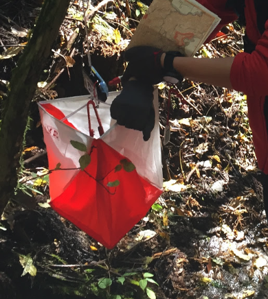

（CP 打卡。有玩过定向越野的朋友应该熟悉这个东西）

拿完报名表便开始走向起点了。

#### 走向起点

起点在最近的小山头，需要七八分钟步行时间。初秋的滑雪场草地也开始泛红，选手们都慢慢迎着阳光走向起点。从报名点到起点五六分钟的路程特别有种所谓的仪式感。

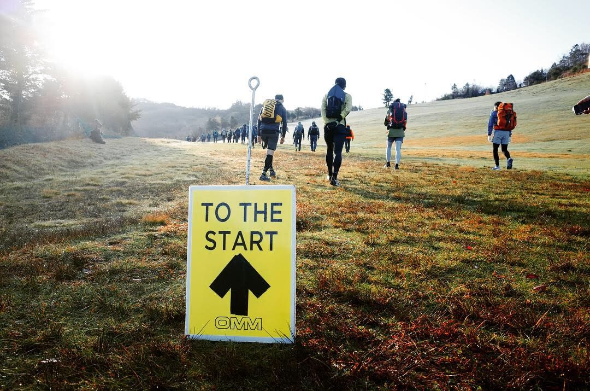

（※ 在 Instagram 上搜 OMM Japan 2018 几乎大多数人都会发起点的这张图，这次的会场和天气实在太漂亮）

起点处也是挤满了人，所有组分为几个阵列排队按顺序出发。

#### 起跑

为了避免定向时 Team 之间影响，参赛项目相同且同一个级别的 Team 前后会有一分钟的间隔。光是所有人出发完就可能花费到一到两个小时。

还有最关键的地图，是收纳在一个盒子里，放在起跑线上。只有前一组出发之后，站在起跑线上才能拿到。

说是起跑，其实也就是稍微跑过了起点门便停了下来。因为拿到地图之后马上就要面临两天里每分钟都要问自己的哲学问题：

**我在哪？我要去哪？**

有趣的是，当你还在确认地图时，周围其他队伍已经开始移动了。这时候很容易被人流带动。然而周围的人参加的级别可能完全不一样，要去的 CP 也就不相同，路线决策也必然不一样。即使同一个级别，也有可能做出不同的路线决策

然而有意思的是，即使心里知道这一点，仍然会不自主地跟着人群跑，并且这样的状况会在比赛中反复出现。

#### 第一个得分点 CP

出发点在山顶，第一个 CP（CP1）写着「BB 岩の西」（BB 岩石的西侧），就在山腰的公路旁。

有意思的是，我没有看到一个人老老实实走车道跑下去，所有人都顺着指南针方向，直接往没有路的树丛里钻。这样的过程也伴随了两天比赛。第二天结束前自然地产生了对指南针无以伦比的崇敬。指南针即是神。

不过指南针只是决定大方向，我们差点跑出公路。只是运气很好在看到岩石前就在路边的杂草丛中发现了 CP 的红色旗帜箱。

#### 深陷泥沼

之后的 CP2 也没有太大难度。顺着公路的小跑，加上简单地判断地形便找到了。然而，从 CP2 走到 CP3 成了这两天最惨的经历。

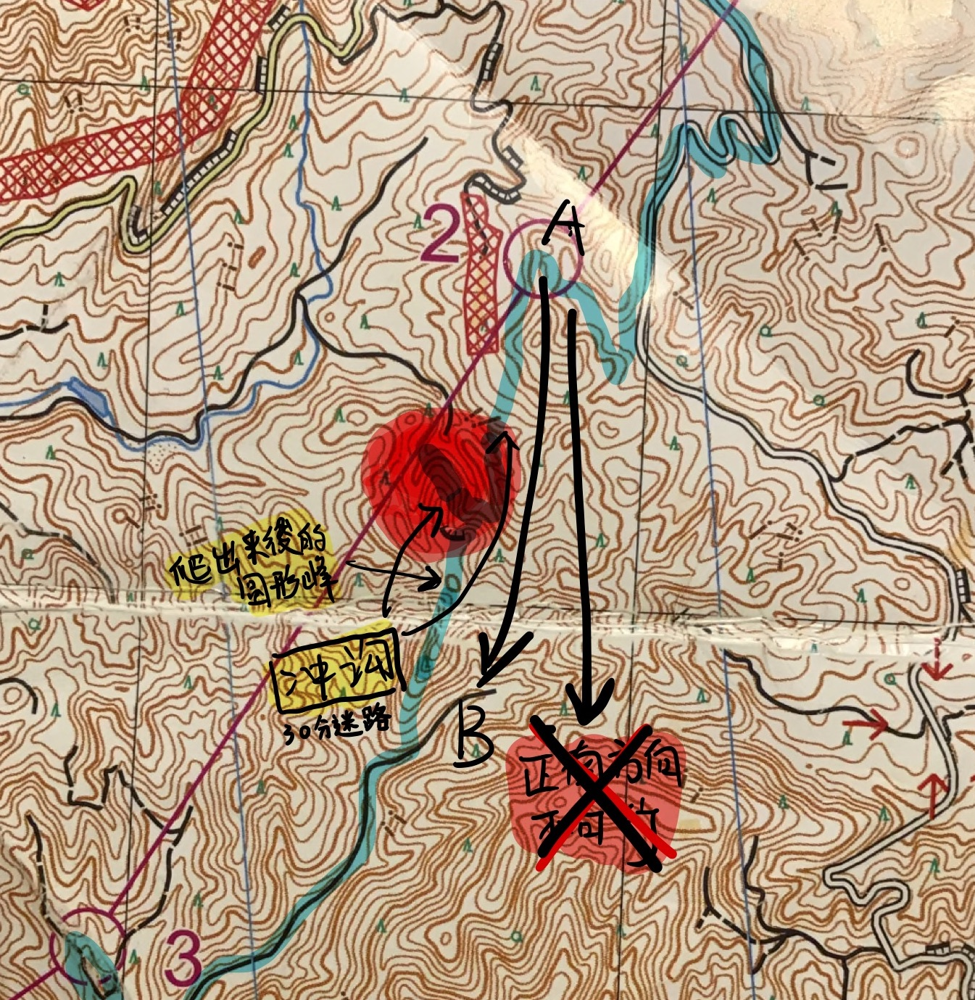

（在比赛时使用的地图上画了一些标记。淡蓝色标记线是我的手表中 GPS 记录的实际行走路线。红色块是我们迷路的地方。地图的比例尺是 1:25000，等高线间距 10米）

我们试图从 A 走到 B 附近的黑色公路。中间没有道路，只能顺着指南针直接翻野山朝南方向走。而且正南方向缺少参照物，一直朝南有可能从两条黑色路之间走出去。

走了十分钟便在冲沟上发现一个小型坝，当时错以为是地图上两地中点标记的坝。如此过早地到达中点打乱了之后的估算。坝之后翻过小山并没有看到道路，而是重新下到了一个很大的冲沟里。

可能由于最近的雨水天气，眼前冲沟形成了一个小溪流，然而在地图上附近并没有溪流的标记。但是很难相信我们会偏到西边的溪流上。各种信息混乱的情况下，我们迷失掉了自己的位置。甚至不知道原路在哪边。

隐约觉得有人沿着溪流方向走出去过，于是和同伴说往溪流下游去探探路。一个来回浪费 10 多分钟什么也没有发现。

这一天的时限是 7 小时，总共有 7 个需要访问的 CP 。于是每个 CP 得控制在 1 小时之内。在 CP2 的时候我们将近花了 1 个小时四五十分钟。接下来的 CP3 几乎没有空闲。在冲沟里已经耗到 3 小时。

无助的情况下，我们赌了一把指南针的正南方，想想爬上山头也许可以有些变化。（其实很盲目）

从冲沟这种地方里爬出来非常消耗体力。背光处土地都是潮湿的淤泥，无法使力。横在路上的倒木也基本上只剩下布满青苔腐烂的树皮，想扶在树干上借力，表皮马上便会凹陷下去。山头上阳光透过树之间的缝隙一点点斜射进来更加突出冲沟下的阴暗。

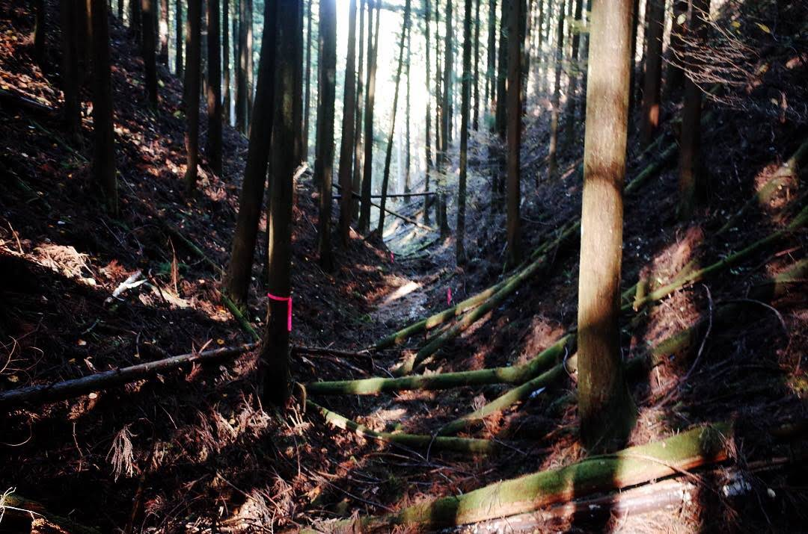

※ 当时没有意识到红线也许是引路标记（因为这种地方红线标记施工或者伐树的可能性太低）

爬上山头之后并没有能够马上确认位置。从另一条路过来其他队的人，经过时跟我们说：

 “后面那个小山头就是地图上的圆形峰哦”

（当然原则上比赛中是不应该交流的:-D）。我爬上去确认完这个圆形峰之后，仍然没法正确在地图上自己的位置。然而只能继续照着指南针直接南进。

幸运的走对了，应该说正南偏西是肯定能靠上去往 CP3 的小路的。五分钟后，终于，面前一个 2 米左右高的小断崖，跳下去便是阔别已久的道路。我们和另一个后面赶上来的队伍几乎同时看到道路，也几乎同时欢呼起来。

到达 CP3 时我们用掉了 3 个半小时。

#### 回到道路之后的大长跑

好不容易从烂泥里回到道路，因为时间不足，能跑的地方几乎是开启全力奔跑模式。这里似乎可以看出组织方路线的规划。CP3, CP4 之后，CP5 直接在地图最西边。中间穿越村落农田，有长段的公路可以走。在 1:25000 的地图上，CP4 和 CP5 的直线距离大约在 5-6 公里。

我们在第四点补充行动食物之后，开始长跑。

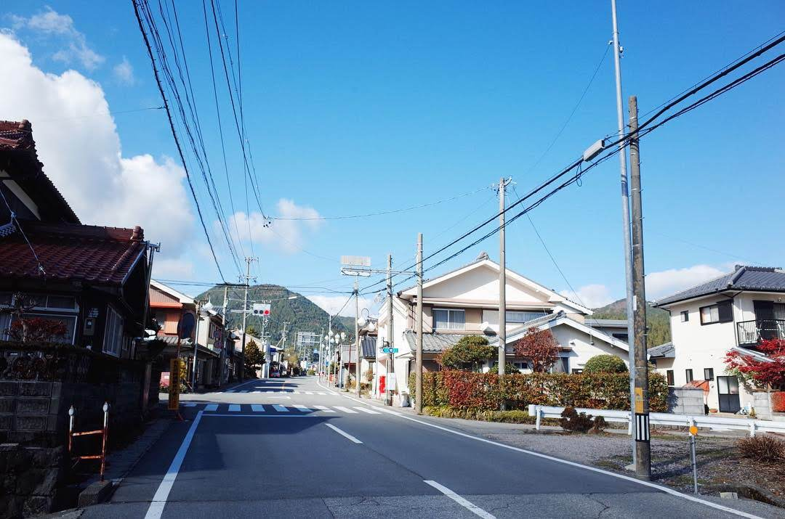

※ 天气很好，不停地跑。路上甚至看到饮料的自动贩卖机。

跑太久之后对距离的概念产生错觉，觉得 CP5 应该差不多就到，以至于再次判断错误所在位置，大概浪费了五到十分钟。

#### 精疲力尽地赶到终点，然而

到达 CP5 时几乎刚好 6 小时。之后还有一个小时时间，大多数队伍也处于收尾阶段，前后都是其他队伍的人。CP5 和 CP6 几乎是跟着人群走到的，没有做任何导航，一路只是在低头跑步。

CP6 之后按着虚线路往北绕了一大圈到 CP7。平时并没有太多跑山，所以这段路时双腿肌肉已经快到极限，好几次有快抽筋的感觉。

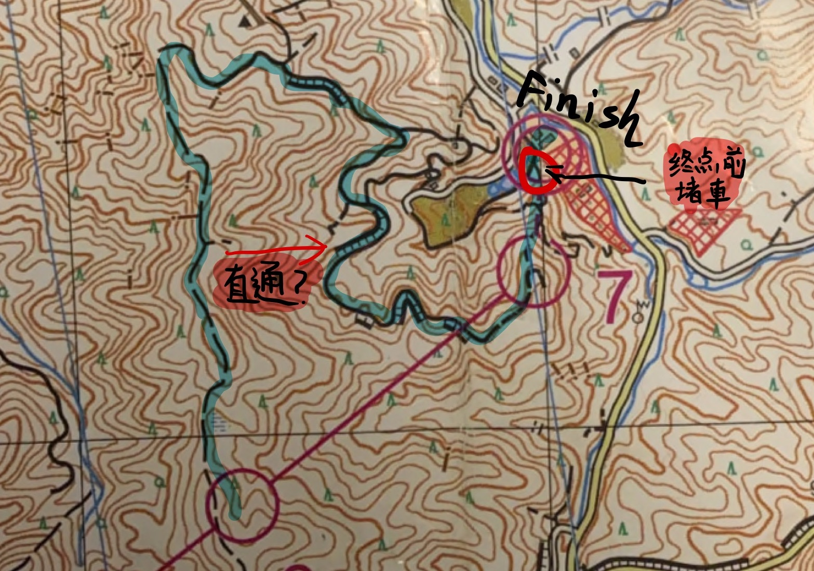 

（蓝色是之后 GPS 记录的路线。向北边绕了一个大圈。现在看来似乎可以在途中直接向东横穿过去。当时只顾低头跑步，没有想过这种可能性。也许受限于当时的体力，和 CP3 时的阴影，没有离开小径自己开路的精力和勇气）

这样跑过 40 分钟才到 CP7 ，而这时我的手表时间已经超过规定时间的 7 小时，寄希望于出发晚的时间差，还是没有放弃继续冲刺。

然而终点前的几乎是单行细道挤满了人，堵车。

其他队伍应该是其他级别，并没有 7 小时时限，并不急，而我们只能跟着人群慢慢移动。

最终跑向终点打卡。**7:03:15**。。。超时失格。

只差了3分钟，这一天的成绩就没有了。

拿到打出的成绩单时，看着 **7:03:15** 这个数字，坐在终点的草皮上十多分钟发呆都没有起来。

这一天，无数个如果，都可以省下这三分十五秒。

#### 搭营，轻量帐篷天堂

然而时间接近下午 4 点，位置在山谷里，所以太阳下山很早，天色开始变暗，深秋的山里也开始冷起来。穿上羽绒服，发呆完必须扎营了。

终点是在一个溪流边的大营地。绿草坪很适合扎营。其他等级项目的队伍也陆续赶过来，大家都开始搭营。位置并不多，每个帐篷之间的间隔都在两米以内的样子。

这是一个轻量帐篷的天堂。

两天背着所有行李跑山注定大家会选择轻量帐篷。单层，半自立式，无杆，金字塔，隧道，各种式样，各种古怪形状的帐篷纷纷展开，似乎户外展会都看不到这么多形状各异的帐篷集合。

扎好自己的营地穿上羽绒服之后离完全天黑还有一些时间，于是到外面转了一圈。我觉得这里应该可以体现日本的轻量露营的一个状况。

首先最多的是日本最大众的 Montbell 和 ARAI TENT。整个营地里 Montbell 的小黄和 ARAI TENT 的小绿两个轻量 Dome 帐占了四成以上的感觉。特别是 Montbell 的小黄，因为便宜，足够轻量，搭营简单，还有不错的质量，在日本的任何山上营地里绝对都是最容易看到的一款帐篷。

其次是 NEMO，MSR，Big Agens 这样的海外品牌，各占二成的样子。不知道是不是因为渠道原因，这些华人圈里很典型的品牌在日本似乎有一点点小众，平时在山里不能说很难看到，但也是偏少。因为在这边店里比欧美贵很多很多，同 “平民” 的 Montbell 比起来，也许在市场上他们都属于高端货吧。（我这次带的 MSR 的帐篷也是在美国买了运到日本，几乎省了一半价格）。不过在玩家扎堆的 OMM 比赛里，这类 “高端” 品牌仍然占了相对比较大的分量。

再小众一点的就是 zerogram 或者是 locus gear 了。论外形奇特的话 zerogram 的外骨骼帐和各种天幕帐都非常拉风。然而会场最养眼的还是各种 locus gear 的金字塔了，一个个空间超大。

另外还有一些叫不上名字的隧道帐，或者是天幕帐篷。

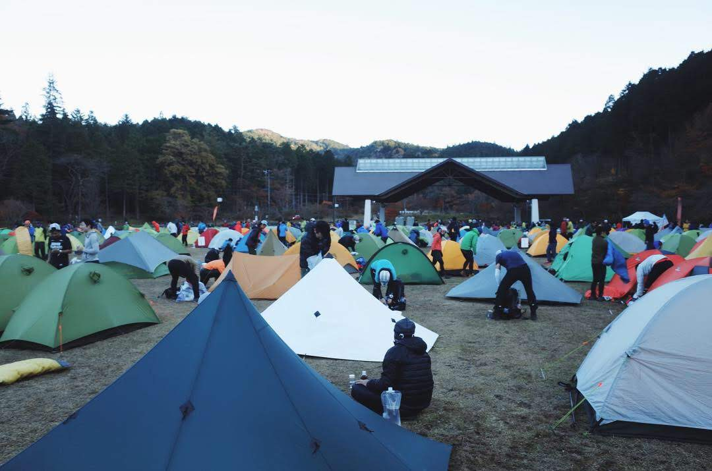

（好多 locus gear 的大金字塔）

逛完之后各自开始烧水做饭了。我和同伴都选择了干米泡饭，和另外一些压缩卡路里食品。压缩卡路里食品泡水之后的甜味非常恶心，差点吐出来。

周围各有各的乐趣，有的无视重量背着红酒过来的，也有慢火烧米饭的。大家似乎都忘了第二天还有比赛，都在营地里吃喝玩闹。

我和同伴因为这一天的失误，吃完泡饭窝在帐篷里打头灯回顾今天的地图，反思路线。我把手表里记录的轨迹导到手机里，比较地图一看，发现除了冲沟那里迷路30分钟以外，我们其实并没有其他明显的失误，横穿路线几乎都是方向正确。所以我们整个跑动的速度太慢，一次迷路就会导致超时。

但是失落归失落，休息前和同伴鼓舞说，今天迟了三分钟，明天的比赛一定给它赚回 30 分钟！

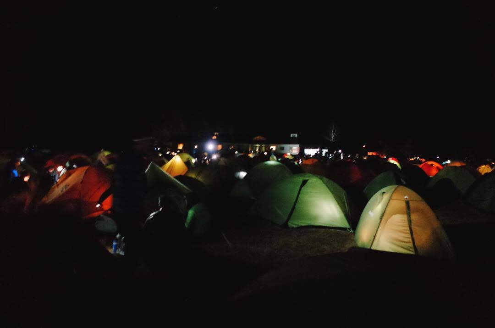

（夜里的营地）

### Day 2

#### 醒来，拔营，出发

第二天早上的出发时间是 6 点半，本打算 4 点半起来早饭拔营的，结果 3 点就被旁边聊天的人吵醒了。（在生活各方面都很有礼貌的日本人，在户外营地却经常会有不太顾虑周围的人，无奈。）

今年比赛日的暖和天气，加上营地在山谷没有任何风。夜晚并没有很冷。为了节省重量，我只带了一个大概只有 300g 不到充绒的 Montbell 的夏季睡袋。在往届，这种装备是要做好挨冻的心理准备的。然而这一晚居然睡得还不错。

唯一的问题在是山谷里的严重潮湿。帐篷碰一下内部就快下雨的感觉，放在睡袋外面的物品也是一层水雾。

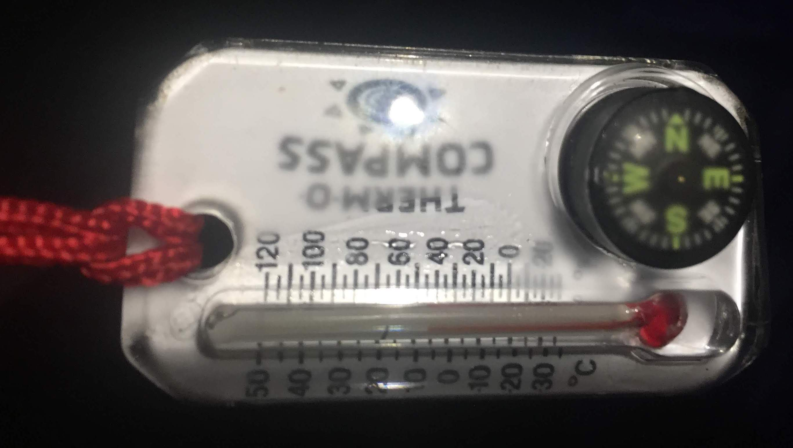

（早上 4 点的照片，6 度的样子，但是湿气大到温度计指南针上一层水雾）

快速吃完冲泡的早餐，5点左右收帐篷了。还没有阳光，潮湿帐篷带了太多水分增重不少。尝试了毛巾擦但效果并不好。好在背包外面的网袋刚好可以悬挂外帐，等太阳出来之后很快就能晒干。

（大家起来拔营中）

出发点在场地 5 分钟的地方。天还没亮，大家还顶着头灯就开始排队了。

#### 逐渐进入状态的第二天

第二天比第一天多了 3 个 CP，但是地图上看，距离似乎缩短了不少。

CP1 几乎是跟着出发的人群一起走到的。

CP1 到 CP2 的途中渐渐进入状态。我们对地图和眼前的实际地形的对比开始变得熟练。在一些明显的的坡道处可以很快找到自己的位置。鉴于昨天的失误，我们顺利完成两个点之后，在赶往 CP3 前的3公里大路也有意识的加速跑。

然而又是在 CP3，因为跟着人群走错路线，多浪费 30 多分钟。不过不像第一天碰运气地从冲沟里爬出来。这次是慢慢停下来仔细判断周围地形发现的错误。

这一天因为路线比较短，有很多简单的循轨迹路线开始多起来。

####“朔溪” 与秘境

CP4 在溪流的上游的转弯处，最简单的路就是沿着溪流走上去。

倒不是真的朔溪，并没有深潭或者瀑布需要跳到溪流中。溪流很小很浅，需要不时地通过溪流上的岩石跳到对岸，或者在浅滩上走。

途中经常会拿出地图看支流或者拿出指南针对比流向是否转变。路程有趣又不难。溪流上的景色非常美。

（走到上游，溪流越来越小）

CP5 则是在完全没有路的山里。溪流走到快到源头时，翻上山，扒开芦苇和树枝朝东走十多分钟便能看到一片开阔的湿地。

应该说是这次比赛最有秘境感的一个地方，满地青苔，阳光从树林里照到青苔上非常美。因为四周都没有路，只有和我们一样从杂树丛的山里翻过来，或者从东边沿着溪流才能走到这个地方。

之前的溪流直上和这片湿地秘境让我们对这次路线策划的组织方佩服之至。

（然而因为抓紧时间赶路，在湿地里一张照片都没有拍，还是让秘境保持神秘感吧 ^^。也可以移步 OMM Japan 的 Facebook 页面，有这次的官方照片）

#### 利用植被分界线找路

湿地之后如何从 CP5 到 CP6， 我们一开始测计划是沿着西向的小溪走到 CP6 附近再往南切。但是在出发时看到西南方向的阔叶林山丘，树之间间隔比较宽，坡度也不大。决定赌一把跟指南针直接朝 CP6 的方向走。

有意思的是，我们注意到地图上非常有一条灰色虚线一直延伸到 CP6 。灰色虚线是植被分界线。在植被分界线两边分别画有圆加小脚的阔叶林标志和三角形的针叶林标志。

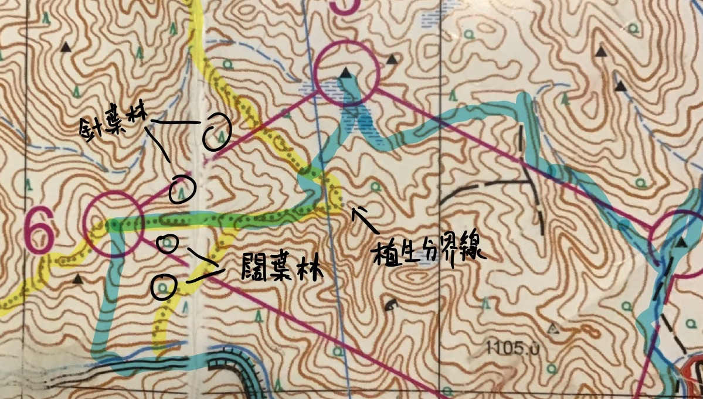

当我们翻上山丘时，反面坡上全是针叶的杉树印证了这一点。

沿着这条界线，加上地形的判断我们轻松地找到了 CP6。

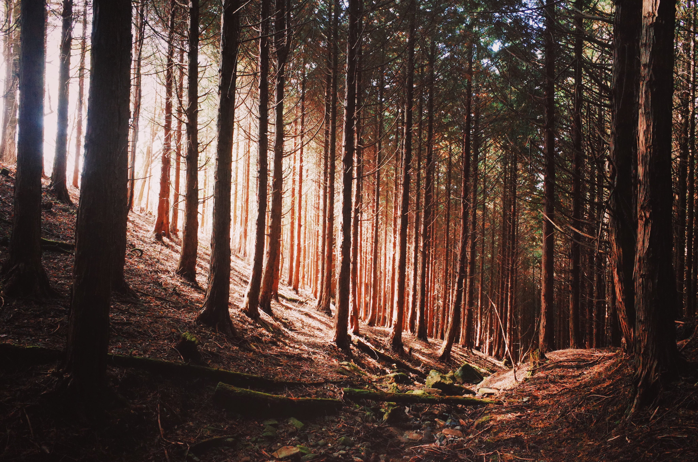

（密密的针叶林，阳光只能斜射进来。右边山坡外面便是已经快掉光树叶的阔叶林，光线充足。）

#### 终点

我们从 CP6 直接向南下山，趟过小河，回到了大路上。之后剩下的 4 个点虽然距离远，但都是在路边，顺理成章轻松的拿下。一路小跑，最后终点竟然就是第一天起点时走过的草坪山坡。

（冲向终点的感觉太棒了）

结果 **6:25:36**。终于比规定时间提前了 30 分钟！

（后来在我手表的记录里，第二天的跑动距离比第一天少了将近 5KM，综合来看其实和前一天没有太大差别啦。我们仍然缺乏更快的跑动。）

终点之后有组织方提供的味增汤，一身汗停下来之后的寒气上来，热汤来的正是时候。

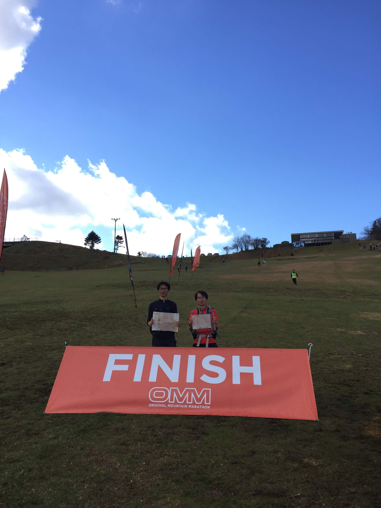

（和搭档拍照纪念）

之后领到了参赛纪念的徽章。

时间是中午两点不到，离 16:00 巴士还有很长时间，终点也有很多赞助商的出展，稍微逛了一下。

我们在终点度假村的餐厅吃了久违的正常餐（两天使用的行动食品真的太难吃）。也几乎花了一个小时晒干背上的汗。

两天辛苦结束。巴士到名古屋，然后悠闲坐新干线回到东京。

## 关于装备

##### 轻量化的部分

从 17 年才开始慢慢换 UL 轻量徒步的装备，手头很多都还是之前负重爬山时的传统装备。比赛之前在可控的预算范围内，做了一些调整。

一是把一直以来登山时使用的 Gregory 50L 大包换成了 Trail Bum 30L 的 Bummer (几乎减1kg)。另一个是把 Nemo 的充气垫换成了山与道的 XLPE 发泡材料的垫子（减轻 300g）。睡袋是用的夏天用的 5度 睡袋套上 SOL 的应急袋（所幸今年的营地非常暖和，并没有到结冰状态）。

选择 Trail Bum 简单的理由就是它很便宜，并且做工在认识的朋友里都评价不错。结构非常简单，但是却留了改造空间（这是买回来之后才发现的）。

在比赛前两周犹豫是否购买时，在代代木的 GearLoop Market 上遇到 Hiker’s depot 的长谷川晋 san，他给了很好的意见，在腰部位置自己加一条胸带来增加稳定性。确实之后在实际比赛中，背负7kg的情况下跑起来也比较稳定。另外我自己也买了两根弹力绳穿在背包背面留的接口上，把山与道的发泡垫绑在背包外面（比赛之后被芦苇丛和荆棘挂破了很多地方）。

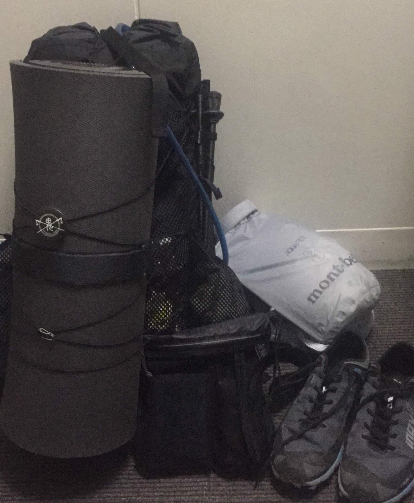

（打包时的样子）

下面是我这次使用的装备列表，实际上并没有特别轻量。

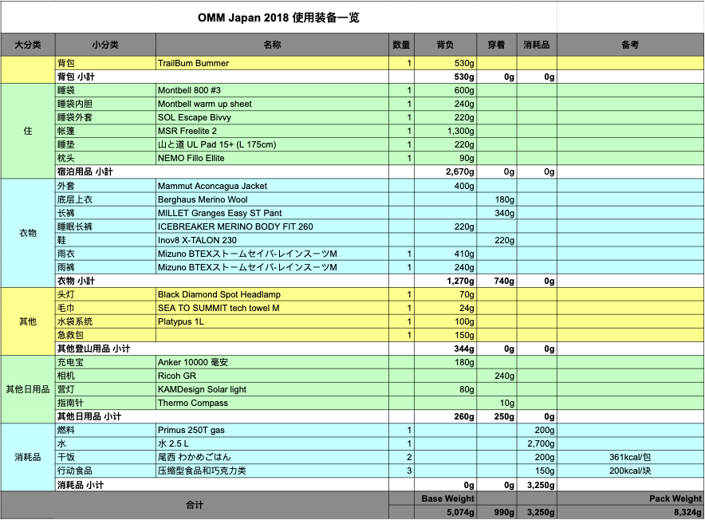

（8 kg 对于越野跑比赛可能有点太重。。）

眠系统可能有点失误。算起来，夏天的轻睡袋 + 睡袋内胆 + 睡袋外套，已经超过了只带一个更温暖秋季睡袋的重量了。另外，NEMO 的充气枕头非常推荐。

衣服方面，因为天气温暖，400g 的 Mammut 抓绒外套几乎全程都在背负中。想改进的是雨衣的部分。比赛前一直想买一套越野跑用的雨衣，苦于预算。

关于食物，只带了不多的行动食品和干饭。一天 6，7 小时跑下来，途中用行动食品非常足够。并没有感觉到特别饿。只是行动食品泡水做成粥之后的难吃程度未曾料及。

##### 其他参加者

因为是第一次参加，我们也好奇大家究竟都带多重的行李。

大多数人都是跑山装备和 UL 背包。但是我们也看到了两个超重装大神，50-60L 的帆布包。好奇地问了一下，他们说玩完这个比赛还打算到山里再露营 3 天。

营地里也有看到并没有使用特别轻量帐篷的队伍。倒是很多人会背着整瓶啤酒或者红酒或者其他 Party 食品跑第一天的路程，就为了在露营地开宴会（即使第二天还要比赛）。

也有不少人会穿 OMM 自家出品的服装和背包，比起一般的越野跑，更适合这项比赛，色调也很搭。

## 总结

一直纠结于 Day 1的失败，比赛之后看主办方公布的成绩列表和报告书略感欣慰。虽然在路线设计团队的意料之中，但今年的 Day 1 的 B，C 级别的完赛率是往年最低的一次（我们参加的 C 级别是 41%，而 B 级别甚至低到 19%）。不过报告里也说，并没有人抱怨路线难，今年的选手们的反馈全是积极的。我们是第一次参加，但看来大家和我们的看法一样，即使感觉到难度高，但在奥三河的秘境山林里两天不乏挑战与趣味，非常感谢主办方的选址和路线设定。

在日本这边，因为安全和环保观念，平时登山徒步基本不会远离登山道，所以你只需要看路标便可以知道自己在哪里。而 OMM 让我们体验到了不依赖 GPS 和正常的道路，纯靠判断地形，读图和指南针来自己找寻道路的过程。之前看户外书里有些迷路现象很难理解，在这两天的冲沟和泥坡上理解了个遍。两天下来左手指南针，右手地图的姿势都快成为了习惯。

前不久 2019 年的 OMM Japan 也公开了比赛地点。长野县的雾峰-车山高原。是一个平均海拔 1500 米以上的草原和山岳地带，可以想象比奥三河的这次要严酷不少。官网有写道，第一天露营地会在多风的开阔地带，预计气温 -10℃- 0℃。看来又会是一个挑战露营装备的舞台！

希望今年能有更多从海外过来的朋友一起参加！

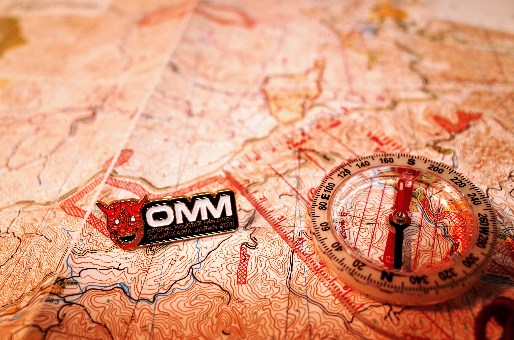

